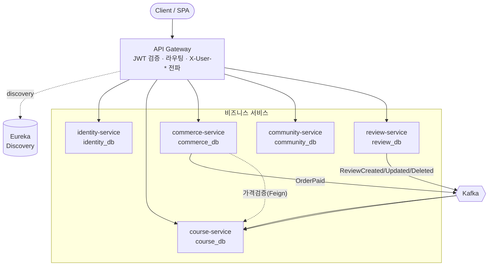

# ddarahakit — MSA 전환 아키텍처 설계

> 모놀리식 Spring Boot 학습 플랫폼을 **이벤트 기반 마이크로서비스**로 점진 전환하는 설계 문서.
> 이 문서는 전환의 기준(SSOT)이며, 각 단계 진행에 따라 갱신한다.

- **베이스라인**: 모놀리스 `main@97c7f9d` (전환 직전 스냅샷)
- **스택**: Java 21, Spring Boot 3.4.2, Spring Cloud 2024.0.x, MariaDB, Kafka
- **전환 방식**: Strangler Fig (무중단 점진 분리)

### 📚 심화 설계 문서
| 문서 | 내용 |
|---|---|
| [docs/01-services.md](docs/01-services.md) | 서비스별 상세 명세(소유 테이블·마이그레이션 엔드포인트·발행/구독 이벤트·동기 의존·FK 절단) |
| [docs/02-event-driven-kafka.md](docs/02-event-driven-kafka.md) | Kafka 토픽 설계·트랜잭션 아웃박스·멱등 소비·재시도/DLT·구매 Saga·평점 투영 |
| [docs/03-auth-gateway.md](docs/03-auth-gateway.md) | 게이트웨이 라우팅·JWT 검증·신원 전파·OAuth2·토큰 회전·마이페이지 BFF |
| [docs/04-database-schema.md](docs/04-database-schema.md) | 서비스별 스키마 DDL 분할(실제 컬럼 기준)·FK 절단·신규 테이블(enrollment/outbox)·데이터 마이그레이션 |
| [docs/05-common-events.md](docs/05-common-events.md) | 공통 모듈 이벤트 계약 코드(봉투·페이로드 record·직렬화·아웃박스/소비 예시) |
| [docs/06-docker-compose.md](docs/06-docker-compose.md) | 전체 스택 compose(MariaDB·Kafka KRaft·Eureka·Gateway·5서비스)·스키마 초기화·포트맵 |
| [docs/07-package-structure.md](docs/07-package-structure.md) | Gradle 멀티모듈·서비스별 패키지 구조·헤더 인증 필터·게이트웨이/디스커버리 |
| [docs/08-phase0-scaffolding.md](docs/08-phase0-scaffolding.md) | **0단계 구현 완료** — 모노레포·common·Eureka·Gateway·compose, 빌드 검증·실행법 |

---

## 1. 목표와 핵심 결정 (ADR 요약)

전환의 1차 목적은 **정석 MSA 패턴 학습·포트폴리오**다. 따라서 단순화보다 **표준 패턴 시연**을 우선한다.

| # | 결정 | 선택 | 근거 |
|---|---|---|---|
| ADR-1 | 서비스 세분화 | **비즈니스 5 서비스 + 이벤트** (review 독립) | 분산 트랜잭션·Saga·이벤트 등 정석 패턴을 최대한 시연 |
| ADR-2 | 데이터 분리 | **스키마 분리 (공유 MariaDB 인스턴스)** | 소유권 경계 확보 + 운영 단순. 추후 물리 분리로 승급 가능 |
| ADR-3 | 서비스 간 통신 | **이벤트 브로커(Kafka) 중심 + 동기(Feign) 보조** | 상태전이는 비동기(최종일관성), 정확성이 필요한 읽기만 동기 |
| ADR-4 | 인증 | **게이트웨이 중심 JWT 검증** | 서비스별 보안필터 제거, 헤더(`X-User-Id`)로 신원 전파 |
| ADR-5 | 리포 구조 | **모노레포(Gradle 멀티모듈)** | 단일 개발자 환경에서 폴리레포보다 관리 용이 |

### 기술 스택
- **API Gateway**: Spring Cloud Gateway (라우팅·JWT 검증·`X-User-*` 전파·CORS·rate-limit)
- **Service Discovery**: Netflix Eureka
- **Messaging**: Apache Kafka (KRaft 단일 브로커) — `OrderPaid`, `ReviewCreated` 등 도메인 이벤트
- **Sync 호출**: Spring Cloud OpenFeign + Resilience4j(Circuit Breaker)
- **관측성**: Micrometer Tracing + Zipkin (분산 추적), 서비스별 springdoc → 게이트웨이 집계
- **DB**: MariaDB (스키마 per service), Flyway 권장(점진 도입)

---

## 2. 현행 모놀리스 결합 분석

도메인 간 import 참조 수(결합 매트릭스)에서 드러난 사실:

```
참조하는 쪽 → 참조되는 도메인 (횟수)
cart       → course(5)  user(2)  orders(1)
community  → course(8)  user(6)  image(1)
course     → review(5)  user(4)  orders(2)
orders     → course(6)  user(4)
review     → course(5)  user(3)
roadmap    → course(4)
user       → community(6) course(6) orders(4) review(4) study(2)   ← 역방향 집계
stats      → course(1) orders(1) review(1)
```

**3가지 시사점:**
1. **`course`가 중력 중심** — 거의 모든 도메인이 의존 → 코어 서비스, 가장 나중에 분리.
2. **`user`는 신원 허브 + "마이페이지 집계자"** — 거꾸로 여러 도메인을 끌어다 *내 강의실/내 글/내 리뷰/주간학습*을 조립(모놀리스 냄새). 분리 시 이 집계는 **밖(BFF/프론트)으로** 빼야 한다.
3. **`review` → `course` 직접 쓰기** — `ReviewRepository.adjustRatingBucket`이 `UPDATE Course SET rating1..5` 로 코스 테이블을 직접 변경. **DB 분리 시 깨지는 1순위 지점 → 이벤트로 전환.**

추가 동기 결합: `orders → course.salePrice`(결제 금액 검증), `course.readLecture → ordersItem.existsBy…`(구매확인).

---

## 3. 목표 서비스 경계



| 서비스 | 스키마 | 소유 테이블 | 책임 |
|---|---|---|---|
| **identity** | `identity_db` | user, refresh_token, email_verify | 인증(login/signup/OAuth2/JWT 발급·회전), 프로필 |
| **course** | `course_db` | course, section, lecture, category, lecture_complete, roadmap, roadmap_course, **enrollment**, **rating 집계** | 카탈로그·수강진도·로드맵 (코어) |
| **commerce** | `commerce_db` | orders, orders_item, cart, cart_item | 주문·결제(PortOne)·환불·장바구니 |
| **community** | `community_db` | post, comment, post_scrap, post_tag | 커뮤니티 |
| **review** | `review_db` | review | 수강평 |

> 외래 도메인 참조는 **FK 제거 → 단순 ID 컬럼**으로 (예: `orders_item.course_idx` = Long, FK 없음).

**경계 밖으로 빠지는 것:**
- **마이페이지 집계**(내 강의실·내 리뷰·내 글·주간학습) → 게이트웨이 **BFF** 또는 프론트 조합.
- **stats**(요약 통계) → 쓰기 서비스가 아닌 **읽기모델/BFF**.

---

## 4. 데이터 소유권 — 까다로운 결합 해소

| 결합 | 모놀리스 현재 | MSA 전환안 |
|---|---|---|
| review → course 평점 | `UPDATE Course SET rating…` 직접 쓰기 | **이벤트** `ReviewCreated/Updated/Deleted` → course가 자기 `rating1..5`·`totalReviewsCount` 갱신 (최종일관성) |
| course 구매확인 | `ordersItem.existsBy…` (course→orders 의존) | course가 **자체 `enrollment` 읽기모델** 보유, `OrderPaid` 이벤트로 채움 → 동기 의존 제거 |
| commerce 결제금액 | `course.getSalePrice()` in-process | **동기 호출(Feign)** 로 가격 검증 + 주문에 **결제시점 가격 스냅샷** 저장 |
| 작성자 표시명 | `post.user.name` 조인 | authorId만 저장, 표시명은 BFF 조합 또는 `UserProfileChanged` 투영(선택) |

---

## 5. 이벤트 카탈로그

| 이벤트 | 발행 | 페이로드 | 구독 → 처리 |
|---|---|---|---|
| `OrderPaid` | commerce | `{orderId, userId, courseIds[], paidAt}` | course → `enrollment` 부여 |
| `OrderRefunded` | commerce | `{orderId, userId, courseIds[]}` | course → `enrollment` 회수 |
| `ReviewCreated` | review | `{reviewId, courseId, userId, rating}` | course → 평점 +1 버킷 |
| `ReviewUpdated` | review | `{reviewId, courseId, oldRating, newRating}` | course → 버킷 이동 |
| `ReviewDeleted` | review | `{reviewId, courseId, rating}` | course → 평점 -1 버킷 |
| `UserDeleted` | identity | `{userId}` | 각 서비스 연관 데이터 정리 |

**규약**: 이벤트는 멱등 처리(consumer 측 idempotency key = eventId), at-least-once 전제. 토픽은 도메인별(`commerce.orders`, `review.reviews` …), 키는 집계 대상 ID(courseId 등)로 순서 보장.

---

## 6. 인증 흐름 (게이트웨이 중심)

```
[Client] --(HttpOnly ATOKEN 쿠키)--> [Gateway]
   Gateway: JWT 검증 → userId/role 추출 → X-User-Id / X-User-Role 헤더로 변환
        --> [downstream service]  (헤더 신뢰, 내부망 격리)
   토큰 발급·회전(/user/login, /user/token/refresh)은 identity-service 전담
```
- 다운스트림 서비스는 JWT를 파싱하지 않고 **게이트웨이가 주입한 헤더**로 신원 판단.
- 게이트웨이 ↔ 서비스 구간은 내부 네트워크로 격리(헤더 위조 방지). 필요 시 서명 헤더/mTLS로 강화.

---

## 7. 리포 구조 (모노레포)

```
ddarahakit_msa/
├─ ARCHITECTURE.md           # 본 문서(개요·SSOT)
├─ docs/                     # 심화 설계(서비스·Kafka·인증)
├─ settings.gradle           # 멀티모듈
├─ infra/
│   ├─ discovery/            # Eureka 서버
│   └─ gateway/              # Spring Cloud Gateway
├─ services/
│   ├─ identity-service/
│   ├─ course-service/
│   ├─ commerce-service/
│   ├─ community-service/
│   └─ review-service/
├─ common/                   # 이벤트 스키마 · BaseResponse (공유 최소화)
├─ monolith/                 # 기존 모놀리스 (Strangler 대상, 단계적 제거)
└─ docker-compose.yml        # mariadb · kafka · eureka · gateway · services
```
> `common` 모듈은 **이벤트 계약·공통 응답만** 담아 "공유 라이브러리 과결합" 안티패턴을 피한다.

---

## 8. 마이그레이션 로드맵 (Strangler Fig)

| 단계 | 목표 | 핵심 작업 | 검증 |
|---|---|---|---|
| **0. 스캐폴딩** | 인프라 골격 | 모노레포 + docker-compose(MariaDB·Kafka·Eureka·Gateway). **모놀리스를 단일 서비스로 등록** | 게이트웨이 경유로 기존 기능 100% 동작 |
| **1. identity** | 인증 권위 분리 | identity-service 추출, 게이트웨이 JWT 검증 패턴 정착 | 로그인/회원/OAuth/토큰회전 E2E |
| **2. community** | 첫 도메인 추출 | 의존 최소 리프 분리, community_db 스키마 | 게시글/댓글/스크랩 CRUD |
| **3. commerce** | 이벤트 도입 | orders+cart 분리, course 가격 Feign 검증, `OrderPaid`→enrollment | 결제→수강권 부여 |
| **4. review** | 분산 평점 | review 분리, `ReviewCreated`→course 평점 투영 | 리뷰 작성 후 평점 최종일관성 |
| **5. course(코어)+stats** | 코어 정리 | 남은 course-service 확립, stats는 BFF/읽기모델 | 전 기능 회귀 |

각 단계는 데이터도 **공유DB → 스키마 분리** 순으로 점진 적용한다.

---

## 9. 진행 현황
- [x] 분해 전략 설계 (본 문서)
- [x] 심화 설계 (docs/01~03: 서비스·Kafka·인증)
- [x] 구현 상세 설계 (docs/04~07: 스키마·이벤트계약·compose·패키지)
- [x] **0단계: 스캐폴딩** (모노레포 + common + Eureka + Gateway + compose, 모놀리스 정적 라우팅) → [docs/08](docs/08-phase0-scaffolding.md)
- [x] **1단계: identity-service** (인증/프로필 추출, identity_db, 게이트웨이 라우팅, 로그인 E2E 검증) → [docs/09](docs/09-phase1-identity.md)
- [x] **2단계: community-service** (community_db, 헤더인증, FK 평문화+스냅샷, identity Feign, E2E 검증) → [docs/10](docs/10-phase2-community.md)
- [ ] 3단계: commerce-service (`OrderPaid`)
- [ ] 4단계: review-service (`ReviewCreated`)
- [ ] 5단계: course-service 코어 + stats BFF
