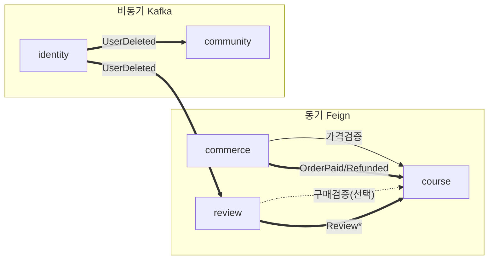

# 01. 서비스별 상세 명세

[← ARCHITECTURE.md](../ARCHITECTURE.md) · 관련: [02. Kafka 이벤트](02-event-driven-kafka.md) · [03. 인증·게이트웨이](03-auth-gateway.md)

5개 비즈니스 서비스의 소유 데이터·API·이벤트·동기 의존을 모놀리스 현행 코드 기준으로 명세한다.
표기: **🔗FK절단** = 모놀리스의 cross-domain FK를 단순 ID 컬럼으로 전환(참조 무결성은 이벤트/검증으로 대체).

---

## 공통 규약
- **응답 포맷**: 기존 `BaseResponse<T>{ success, code, message, results }` 유지(`common` 모듈).
- **신원 전달**: 게이트웨이가 검증 후 `X-User-Id`, `X-User-Role` 헤더 주입 → 서비스는 이 헤더로 인가. JWT 직접 파싱하지 않음([03 참고](03-auth-gateway.md)).
- **DB**: 서비스별 전용 스키마(공유 MariaDB 인스턴스), **cross-schema FK 금지**.
- **이벤트 발행**: 반드시 **트랜잭션 아웃박스**를 경유([02 참고](02-event-driven-kafka.md)).
- **이벤트 소비**: 멱등(`processed_event` 중복 차단), at-least-once 전제.

---

## 1) identity-service  · `identity_db`

신원·인증의 권위(authority). 토큰 발급/검증의 기준점.

**소유 테이블**: `user`, `refresh_token`, `email_verify`

**마이그레이션 엔드포인트** (현 `UserController` 중 인증/프로필):
| 메서드 | 경로 | 비고 |
|---|---|---|
| POST | `/user/login`, `/user/social/login` | 토큰 발급 |
| POST | `/user/logout`, `/user/logout/all` | 토큰 무효화 |
| GET | `/user/token/refresh` | 액세스 재발급(회전) |
| POST | `/user/signup`, `/user/email/verify` | 가입·인증 |
| GET | `/user/check`, `/user/email/duplicate`, `/user/uuid/check` | |
| POST/PUT | `/user/password/reset`, `/user/password/update` | |
| GET/PUT/POST | `/user/profile` | 프로필 조회/수정/이미지 |

**발행 이벤트**: `UserRegistered`(가입확정), `UserProfileChanged`(표시명/이미지), `UserDeleted`(탈퇴)
**구독 이벤트**: 없음
**동기 의존**: 없음 (다른 서비스가 identity를 의존)
**🔗FK절단**: `email_verify.user_idx`는 같은 스키마라 유지.

> ⚠️ 모놀리스의 **마이페이지 집계**(`/user/ordered`,`/user/myreview`,`/user/mypost`,`/user/myquestion`,`/user/study/weekly`,`/user/payments`)는 **identity에서 제거** → 게이트웨이 BFF가 각 서비스 조합([03 BFF](03-auth-gateway.md)).

---

## 2) course-service  · `course_db`  (코어)

카탈로그·수강진도·로드맵 + **타 서비스 이벤트의 읽기모델 보유**.

**소유 테이블**: `course`, `section`, `lecture`, `category`, `lecture_complete`, `roadmap`, `roadmap_course`
**신규(읽기모델)**: `enrollment`(userId, courseId, grantedAt), `course` 내 `rating1..5`·`total_reviews_count`(이벤트로 갱신)

**마이그레이션 엔드포인트** (`CourseController`, `LectureController`, `RoadmapController`, `StatsController` 일부):
| 메서드 | 경로 |
|---|---|
| GET | `/course/category`, `/course/list`, `/course/list/{slug}`, `/course/search`, `/course/{courseIdx}` |
| GET | `/course/lecture/{courseIdx}/{lectureIdx}` (수강권 확인 → `enrollment` 조회) |
| POST | `/course/lecture/complete` (진도) |
| POST | `/lecture/create` (관리자) |
| GET/PUT/DELETE | `/roadmap/...` |

**발행 이벤트**: `CourseChanged`(가격/제목 등, commerce 캐시 무효화용 선택), `LectureCompleted`(통계용 선택)
**구독 이벤트**:
- `OrderPaid` → `enrollment` 부여 / `OrderRefunded` → 회수
- `ReviewCreated/Updated/Deleted` → `rating` 버킷 갱신
**동기 제공(Feign 피호출)**: `GET /internal/courses/{id}`(가격·존재 검증, commerce가 호출)
**🔗FK절단**: `course.user_idx`(작성자), `lecture_complete.user_idx` → Long. `course.getOrders()/getReviews()` 컬렉션 **제거** → `enrollment` 카운트·`rating` 집계로 대체(이미 `totalOrderedCount`는 enrollment 수, `totalReviewsCount`는 집계 컬럼).

---

## 3) commerce-service  · `commerce_db`

주문·결제·환불·장바구니. 결제 정확성 때문에 course 가격을 **동기 검증**.

**소유 테이블**: `orders`, `orders_item`(+`unit_price` 스냅샷), `cart`, `cart_item`

**마이그레이션 엔드포인트** (`OrdersController`, `CartController`):
| 메서드 | 경로 |
|---|---|
| POST | `/orders/create`, `/orders/verify`, `/orders/{id}/free-complete`, `/orders/{id}/refund` |
| GET | `/orders/check/{courseIdx}`, `/orders/{id}/receipt` |
| DELETE | `/orders/{id}` |
| GET/POST/DELETE | `/cart`, `/cart/count`, `/cart/{cartItemIdx}` |

**발행 이벤트**: `OrderPaid`{orderId,userId,courseIds[],paidAt}, `OrderRefunded`{orderId,userId,courseIds[]}
**구독 이벤트**: 없음 (필요 시 `CourseChanged`로 가격 캐시 무효화)
**동기 의존(Feign 호출)**: course `GET /internal/courses/{id}` — 주문 생성/검증 시 **서버측 가격 재검증**(현 `OrdersService`의 `salePrice` 합계 검증을 대체). 호출 실패 시 Resilience4j 서킷브레이커.
**🔗FK절단**: `orders.user_idx`, `orders_item.course_idx` → Long. `cart.user_idx`, `cart_item.course_idx` → Long. **`orders_item.unit_price` 스냅샷 추가**(결제 시점 가격 보존 → course 가격 변동과 무관한 영수증 정합).
**구매확인 일원화**: 모놀리스의 `course.readLecture`가 하던 `ordersItem.existsBy…`는 사라지고, **수강권은 course의 `enrollment`** 가 단일 출처(OrderPaid로 채움).

---

## 4) community-service  · `community_db`

게시글·댓글·스크랩·태그. course/lecture는 약한 참조(질문이 어떤 강의에 대한 것인지).

**소유 테이블**: `post`, `comment`, `post_scrap`, `post_tag`

**마이그레이션 엔드포인트** (`CommunityController` 전체): `/community/list`, `/community/{postIdx}`, `/community/post`(CRUD), `/community/comment`(CRUD/accept), `/community/scrap/*`, `/community/ranking`, `/community/{postIdx}/related`, `/community/types`, `/community/upload`

**발행 이벤트**: (선택) `PostCreated`(랭킹/알림 확장 대비)
**구독 이벤트**: `UserDeleted` → 작성 글/댓글 정리(또는 익명화), `UserProfileChanged` → 표시명 캐시(선택)
**동기 의존**: 작성자 표시명은 BFF 조합 또는 `authorName` 캐시 컬럼(이벤트 투영). course/lecture 명칭도 동일.
**🔗FK절단**: `post.user_idx`/`post.course_idx`/`post.lecture_idx`, `comment.user_idx`, `post_scrap.user_idx` → Long. `comment.post_idx`, `post_scrap.post_idx`, `post_tag.post_idx`는 같은 스키마라 유지.

---

## 5) review-service  · `review_db`

수강평. **평점 집계는 직접 쓰지 않고 이벤트로 course에 위임**(전환의 핵심).

**소유 테이블**: `review`

**마이그레이션 엔드포인트** (`ReviewController`): `GET/POST/PUT/DELETE /review/{courseIdx}`

**발행 이벤트**: `ReviewCreated`{reviewId,courseId,userId,rating}, `ReviewUpdated`{…,oldRating,newRating}, `ReviewDeleted`{reviewId,courseId,rating}
**구독 이벤트**: `UserDeleted` → 리뷰 정리
**동기 의존**: (선택) 리뷰 작성 시 course `GET /internal/courses/{id}/enrollment?userId=` 로 **구매자만 작성** 검증 — 현 모놀리스에 없는 검증을 MSA 전환과 함께 추가(권장).
**🔗FK절단**: `review.user_idx`, `review.course_idx` → Long. **모놀리스의 `UPDATE Course SET rating…` 제거** → `ReviewCreated/Updated/Deleted` 이벤트로 대체([02 평점 투영](02-event-driven-kafka.md)).

---

## 의존 요약

- **동기 결합 최소화**: 결제 가격 검증 1건만 강결합(정확성 필수). 나머지는 전부 이벤트.
- **course가 읽기모델 허브**: enrollment(주문발) + rating(리뷰발)을 투영해 자기 응답을 자족적으로 구성 → 상세조회 시 타 서비스 호출 0.
