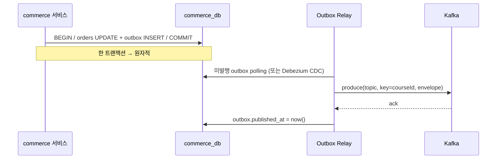
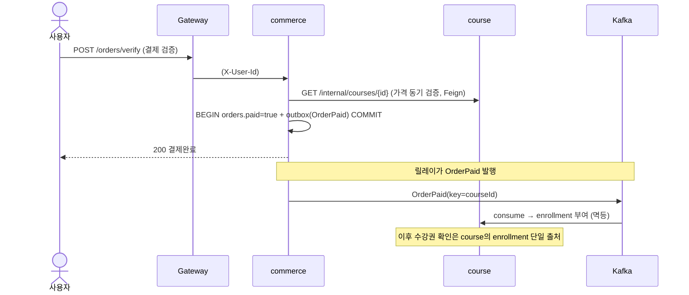
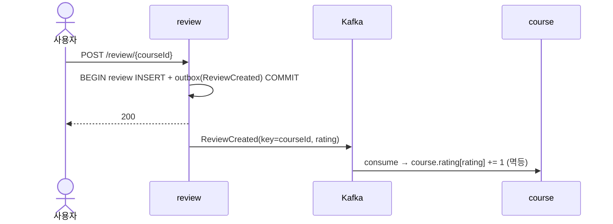

# 02. 이벤트 드리븐 설계 (Apache Kafka)

[← ARCHITECTURE.md](../ARCHITECTURE.md) · 관련: [01. 서비스 명세](01-services.md) · [03. 인증·게이트웨이](03-auth-gateway.md)

서비스 간 상태전이는 **Kafka 도메인 이벤트**로 전파한다. 핵심 원칙:
**아웃박스로 안전하게 발행 → 키로 순서 보장 → 멱등하게 소비 → 실패는 재시도·DLT.**

---

## 1. 토픽 설계

| 토픽 | 발행자 | 키(partition key) | 파티션 | 보존 | 이벤트 |
|---|---|---|---|---|---|
| `commerce.order.v1` | commerce | `courseId` | 3 | 7d | OrderPaid, OrderRefunded |
| `review.review.v1` | review | `courseId` | 3 | 7d | ReviewCreated/Updated/Deleted |
| `identity.user.v1` | identity | `userId` | 3 | 7d | UserRegistered/ProfileChanged/Deleted |
| `*.DLT` | (오류 핸들러) | 원본 키 | 1 | 14d | 처리 실패 이벤트 격리 |

**설계 의도**
- **토픽 = 발행 도메인 단위**(`<domain>.<aggregate>.v<major>`). 소비자는 한 토픽에서 여러 이벤트 타입을 헤더 `eventType`으로 분기.
- **키 = 집계 ID**: 평점/수강권은 `courseId` 기준이라 키를 `courseId`로 두면 **같은 코스 이벤트가 같은 파티션 → 순서 보장**(ReviewUpdated가 ReviewCreated보다 먼저 처리되는 일 방지).
- **버전은 토픽명에 major**(`.v1`), 하위호환 변경은 필드 추가만. 파괴적 변경은 `.v2` 신토픽 + 듀얼 컨슘.
- 단일 PC라 파티션 3·복제 1(KRaft 단일 브로커). 운영 확장 시 복제 3으로.

### 이벤트 봉투(envelope) — JSON
```json
{
  "eventId": "uuid",            // 멱등 키 (소비자 중복 차단)
  "eventType": "OrderPaid",
  "version": 1,
  "occurredAt": "2026-06-26T10:00:00Z",
  "traceId": "…",               // 분산추적 전파
  "payload": { "orderId": 123, "userId": 7, "courseIds": [11,3], "paidAt": "…" }
}
```
- 직렬화는 **JSON + 버전드 계약**(`common` 모듈의 record). 추후 스키마 강제는 **Confluent Schema Registry + Avro**로 승급 가능(계약 위반 컴파일/런타임 차단). 시작은 JSON로 단순하게.

---

## 2. 트랜잭션 아웃박스 (이중쓰기 문제 해결) ★

"DB 저장 + Kafka 발행"을 따로 하면 한쪽만 성공하는 **이중쓰기 불일치**가 난다.
→ 비즈니스 변경과 **이벤트 적재를 같은 로컬 트랜잭션**에 묶고, 별도 릴레이가 Kafka로 옮긴다.

```sql
-- 각 서비스 스키마마다 1개
CREATE TABLE outbox (
  id            BIGINT AUTO_INCREMENT PRIMARY KEY,
  event_id      CHAR(36)     NOT NULL UNIQUE,
  aggregate     VARCHAR(50)  NOT NULL,   -- 'order'
  aggregate_id  VARCHAR(50)  NOT NULL,   -- partition key 원천
  topic         VARCHAR(100) NOT NULL,
  event_type    VARCHAR(50)  NOT NULL,
  payload       JSON         NOT NULL,
  created_at    DATETIME(6)  NOT NULL,
  published_at  DATETIME(6)  NULL,       -- NULL=미발행
  INDEX idx_unpublished (published_at, id)
);
```



- **릴레이 방식 2택**: (a) 스케줄 폴링 퍼블리셔(간단, 시작용) (b) **Debezium CDC**(binlog tailing, 지연·부하 ↓, 정석). 0~3단계는 (a), 여유 시 (b)로 승급.
- 릴레이는 at-least-once(중복 가능) → **소비자 멱등으로 흡수**.

---

## 3. 멱등 소비자

```sql
-- 각 소비 서비스 스키마
CREATE TABLE processed_event (
  event_id    CHAR(36) PRIMARY KEY,
  consumer    VARCHAR(80) NOT NULL,
  processed_at DATETIME(6) NOT NULL
);
```
처리 트랜잭션 안에서 `INSERT processed_event(event_id)` 시도 → **중복키면 skip**(이미 처리). 투영 갱신과 같은 트랜잭션으로 묶어 "처리=기록"을 원자화.

```java
@KafkaListener(topics = "review.review.v1", groupId = "course-rating")
@Transactional
public void on(ConsumerRecord<String,Envelope> rec) {
    Envelope e = rec.value();
    if (!processedEventRepo.tryInsert(e.eventId(), "course-rating")) return; // 멱등
    switch (e.eventType()) {
        case "ReviewCreated" -> course.applyRating(e.courseId(), e.rating(), +1);
        case "ReviewDeleted" -> course.applyRating(e.courseId(), e.rating(), -1);
        case "ReviewUpdated" -> { course.applyRating(e.courseId(), e.oldRating(), -1);
                                  course.applyRating(e.courseId(), e.newRating(), +1); }
    }
}
```

---

## 4. 재시도 · DLT (오류 격리)
- Spring Kafka `DefaultErrorHandler` + `DeadLetterPublishingRecoverer`.
- 일시 오류(네트워크 등): 지수백오프 N회 재시도 → 초과 시 `*.DLT`로 격리(서비스는 계속 진행).
- DLT는 사람이 점검/재처리. 멱등이라 재투입 안전.

---

## 5. 핵심 플로우 — 구매 Saga (OrderPaid → 수강권)



- **결제 응답은 즉시**(동기 가격검증 통과 후 paid 확정), **수강권 부여는 최종일관성**(이벤트). 수강 진입 직전 enrollment 미반영일 극히 짧은 창은 재조회/짧은 폴링으로 흡수.
- **환불**: `OrderRefunded` → course가 enrollment 회수(보상).

## 6. 핵심 플로우 — 평점 투영 (Review → Course)


- 모놀리스의 `UPDATE Course SET rating1..5`(리뷰→코스 직접쓰기)를 **이벤트 투영으로 대체**. 작성 직후 목록 평점은 수 초 내 일관성.

---

## 7. 관측성·운영
- **분산추적**: `traceId`를 envelope·헤더로 전파(Micrometer Tracing) → 게이트웨이~Kafka~소비까지 한 트레이스로 추적.
- **모니터링**: consumer lag(파티션별), DLT 적재량, outbox 미발행 적체를 지표화.
- **정확성 등급**: 본 설계는 **at-least-once + 멱등 = 효과적 정확히-한-번**. Kafka 트랜잭션(EOS)까지는 도입하지 않음(아웃박스+멱등으로 충분, 복잡도 절감).

## 8. 로컬 인프라 (docker-compose)
```yaml
kafka:            # KRaft 단일 브로커(Zookeeper 불필요)
  image: bitnami/kafka:3.7
  environment: [ KAFKA_CFG_NODE_ID=1, KAFKA_CFG_PROCESS_ROLES=broker,controller, ... ]
kafka-ui:         # 토픽/lag/DLT 가시화 (선택)
  image: provectuslabs/kafka-ui
```
