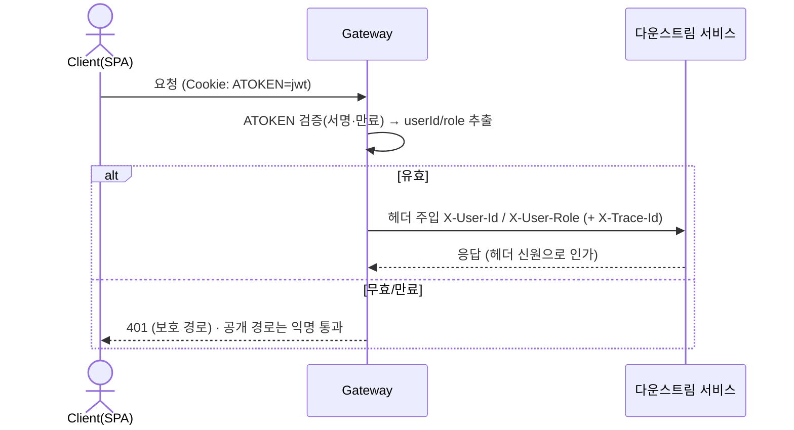
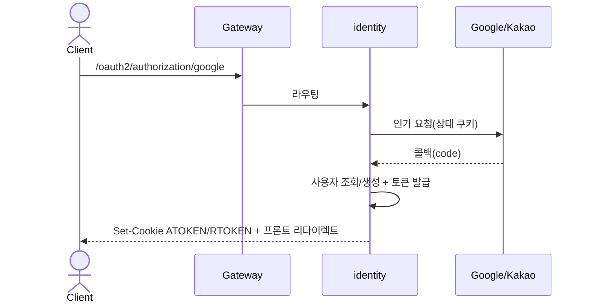
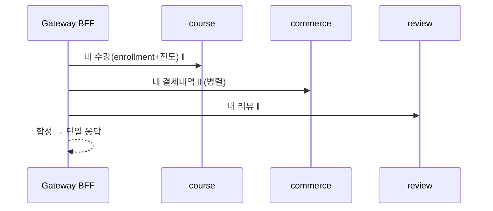

# 03. 인증 · API 게이트웨이

[← ARCHITECTURE.md](../ARCHITECTURE.md) · 관련: [01. 서비스 명세](01-services.md) · [02. Kafka 이벤트](02-event-driven-kafka.md)

게이트웨이가 **인증의 단일 관문**이다. JWT 검증·라우팅·신원 전파·CORS·rate-limit을 전담하고,
다운스트림 서비스는 게이트웨이가 주입한 신원 헤더만 신뢰한다(서비스별 JWT 파싱 제거).

---

## 1. 라우팅 테이블 (Spring Cloud Gateway + Eureka `lb://`)

| 경로 패턴 | 대상 | 인증 |
|---|---|---|
| `/user/login`, `/user/signup`, `/user/social/**`, `/user/token/refresh`, `/user/email/**`, `/user/password/reset`, `/user/check`, `/user/uuid/check` | identity | 공개 |
| `/user/logout`, `/user/profile`, `/user/password/update`, `/user/logout/all` | identity | 필요 |
| `/course/**`, `/roadmap/**`, `/stats/**` (GET) | course | 공개 |
| `/course/lecture/complete`, `/lecture/create` | course | 필요 |
| `/orders/**`, `/cart/**` | commerce | 필요 |
| `/community/**` (GET) / (쓰기) | community | 공개 / 필요 |
| `/review/{id}` GET / (쓰기) | review | 공개 / 필요 |
| `/me/**` (마이페이지 집계) | **gateway BFF** | 필요 |

- 라우팅은 **Eureka 서비스명**(`lb://course-service`)으로 디스커버리 기반.
- 공개/보호 구분은 게이트웨이 필터에서 1차 결정, 서비스는 헤더 유무로 2차 인가(심층방어).

---

## 2. JWT 검증 & 신원 전파

- **게이트웨이 글로벌 필터**가 `ATOKEN` 쿠키의 JWT를 검증(jjwt, identity와 동일 시크릿). 통과 시 `X-User-Id`/`X-User-Role` 주입.
- **클라이언트가 보낸 `X-User-*` 헤더는 게이트웨이에서 제거(strip) 후 재주입** → 헤더 위조 차단.
- 게이트웨이↔서비스 구간은 **내부 네트워크 격리**(도커 네트워크, 호스트 미노출). 강화 필요 시 내부 호출에 짧은 수명 서명 헤더/mTLS.
- 무효 토큰이 **공개 경로를 막지 않도록**(모놀리스에서 이미 고친 규칙) 익명 통과 유지.

---

## 3. OAuth2 (Google/Kakao) — MSA에서의 위치

OAuth2 콜백·소셜 사용자 처리는 **identity-service**가 전담(`/oauth2/**`, `/login/oauth2/**`은 게이트웨이가 identity로 라우팅).

> 전환 시 개선 반영: 소셜 계정 비밀번호를 평문 provider명 대신 **랜덤 인코딩값**으로(모놀리스 점검 지적사항).

---

## 4. 토큰 발급·회전·검증의 책임 분리

| 책임 | 위치 | 비고 |
|---|---|---|
| 발급(로그인/소셜) | identity | Access(30m)·Refresh(7d) HttpOnly 쿠키 |
| 검증(요청별) | **gateway** | 서명·만료만. DB 조회 없음(무상태) |
| 회전(`/user/token/refresh`) | identity | RTOKEN 검증 → DB의 refresh_token 확인·재발급 |
| 무효화(logout/탈퇴) | identity | DB refresh_token 삭제 |

- **검증을 게이트웨이로, 발급/회전을 identity로** 분리 → 매 요청 DB 조회 없이 확장. Refresh만 identity가 상태 확인.
- 쿠키 속성(SameSite=Strict 등)은 모놀리스 정책 유지([쿠키 검토 결과](../ARCHITECTURE.md) 참조). 게이트웨이가 `Set-Cookie`를 그대로 통과.

---

## 5. 마이페이지 BFF (`/me/**`)

모놀리스 `UserService`의 cross-domain 집계를 게이트웨이 BFF로 이동. 여러 서비스를 **병렬 조합**.

| BFF 엔드포인트 | 조합 대상 |
|---|---|
| `/me/courses` (내 강의실) | course(enrollment·진도) |
| `/me/payments` | commerce |
| `/me/reviews` | review |
| `/me/posts`, `/me/questions` | community |
| `/me/study/weekly` | course(lecture_complete 집계) |

- 표시명·코스명 등은 BFF에서 조합(또는 각 서비스의 이벤트 투영 캐시).
- BFF는 얇게 유지(조합·합성만, 비즈니스 로직 금지). 복잡해지면 별도 BFF 서비스로 분리.

---

## 6. 횡단 관심사 (게이트웨이)
- **CORS**: 허용 오리진(www/apex) 화이트리스트 — 게이트웨이에서 일원화(서비스별 CORS 제거).
- **Rate limiting**: `RequestRateLimiter`(Redis) 또는 IP 기준 — 로그인/이메일중복 등 남용 경로 보호.
- **에러 규약**: 다운스트림 `BaseResponse` 그대로 전달, 게이트웨이 자체 오류(라우팅/타임아웃)도 동일 포맷으로 변환.
- **분산추적**: `X-Trace-Id` 생성·전파(서비스·Kafka까지 동일 트레이스).
