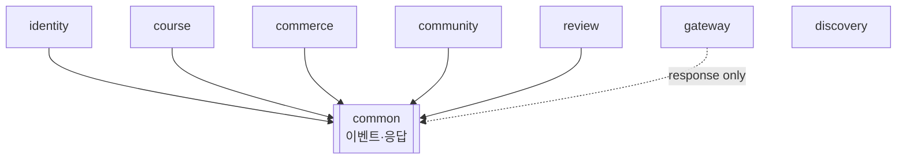

# 07. 패키지 구조 · 멀티모듈 레이아웃

[← ARCHITECTURE.md](../ARCHITECTURE.md) · 관련: [05. 공통 모듈](05-common-events.md) · [06. docker-compose](06-docker-compose.md)

모노레포(Gradle 멀티모듈). 각 서비스는 **독립 실행 가능한 Spring Boot 앱**이며 `common`만 공유한다.

## 1. 루트 레이아웃 / `settings.gradle`

```
ddarahakit_msa/
├─ settings.gradle / build.gradle        # 공통 플러그인·BOM(Spring Cloud)
├─ common/                               # 이벤트 계약·공통 응답 (라이브러리)
├─ infra/
│   ├─ discovery/                        # Eureka 서버
│   └─ gateway/                          # Spring Cloud Gateway
├─ services/
│   ├─ identity-service/
│   ├─ course-service/
│   ├─ commerce-service/
│   ├─ community-service/
│   └─ review-service/
├─ monolith/                             # 기존 모놀리스(Strangler 대상)
├─ infra/db/init/                        # 스키마 생성 SQL
└─ docker-compose.yml
```

```groovy
// settings.gradle
rootProject.name = 'ddarahakit_msa'
include 'common'
include 'infra:discovery', 'infra:gateway'
include 'services:identity-service', 'services:course-service',
        'services:commerce-service', 'services:community-service', 'services:review-service'
// include 'monolith'   // 0단계 동안만
```

```groovy
// build.gradle (루트 — 공통 설정 일괄)
subprojects {
    apply plugin: 'java'
    apply plugin: 'io.spring.dependency-management'
    java { toolchain { languageVersion = JavaLanguageVersion.of(21) } }
    dependencyManagement {
        imports {
            mavenBom "org.springframework.boot:spring-boot-dependencies:3.4.2"
            mavenBom "org.springframework.cloud:spring-cloud-dependencies:2024.0.0"
        }
    }
}
```

## 2. 비즈니스 서비스 패키지 구조 (레이어드, 도메인 중심)

모놀리스의 도메인 패키지 구조를 **서비스 단위로 승격**. 예: `course-service`.

```
services/course-service/
├─ build.gradle                          # web, data-jpa, kafka, eureka-client, openfeign, common
└─ src/main/java/com/ddarahakit/course/
    ├─ CourseServiceApplication.java
    ├─ config/                           # Security(헤더인증), Kafka, Feign, OpenApi
    ├─ web/                              # @RestController (= 모놀리스 controller)
    │   ├─ CourseController.java
    │   ├─ LectureController.java
    │   ├─ RoadmapController.java
    │   └─ internal/CourseInternalController.java   # GET /internal/courses/{id} (Feign 피호출)
    ├─ service/                          # 비즈니스 로직
    ├─ domain/                           # @Entity (course/section/lecture/category/…/enrollment)
    ├─ repository/                       # Spring Data JPA
    ├─ dto/
    ├─ messaging/
    │   ├─ consumer/                     # @KafkaListener (OrderPaid→enrollment, Review*→rating)
    │   ├─ outbox/                       # OutboxEntity, OutboxAppender, OutboxRelay (발행 시)
    │   └─ idempotency/                  # ProcessedEvent
    └─ client/                           # (필요 시) FeignClient 인터페이스
└─ src/main/resources/
    ├─ application.yml                   # 포트 8080, eureka, datasource(course_db), kafka
    └─ db/migration/                     # Flyway V1__init.sql (서비스 소유 테이블)
```

**서비스별 차이(messaging 패키지):**
| 서비스 | consumer | outbox(발행) |
|---|---|---|
| identity | — | User* |
| course | OrderPaid/Refunded, Review* | (선택) CourseChanged |
| commerce | — | OrderPaid, OrderRefunded |
| community | UserDeleted | (선택) PostCreated |
| review | UserDeleted | ReviewCreated/Updated/Deleted |

**인증 처리**: 각 서비스 `config/SecurityConfig`는 JWT 파싱을 하지 않고, 게이트웨이가 주입한 `X-User-Id`/`X-User-Role` 헤더를 읽는 얇은 필터(`HeaderAuthenticationFilter`)만 둔다([03 참조](03-auth-gateway.md)).

```java
// 공통 패턴: 헤더 → SecurityContext
public class HeaderAuthenticationFilter extends OncePerRequestFilter {
    protected void doFilterInternal(HttpServletRequest req, ...) {
        String userId = req.getHeader("X-User-Id");
        String role   = req.getHeader("X-User-Role");
        if (userId != null) {
            var auth = new UsernamePasswordAuthenticationToken(
                Long.valueOf(userId), null, List.of(new SimpleGrantedAuthority(role)));
            SecurityContextHolder.getContext().setAuthentication(auth);
        }
        chain.doFilter(req, res);
    }
}
```

## 3. identity-service (인증 특수성)

JWT/OAuth2를 **발급**하는 유일한 서비스라 보안 의존이 더 두껍다.

```
services/identity-service/src/main/java/com/ddarahakit/identity/
├─ config/security/         # SecurityConfig, OAuth2 SuccessHandler, JwtProvider, TokenService
│   ├─ oauth/               # OAuth2UserService, HttpCookieAuthorizationRequestRepository
│   └─ token/               # RefreshToken 엔티티·회전·정리 스케줄러
├─ web/                     # UserController (login/signup/refresh/profile/…)
├─ service/                 # UserService, EmailService
├─ domain/                  # User, RefreshToken, EmailVerify
├─ repository/
└─ messaging/outbox/        # UserRegistered/ProfileChanged/Deleted
```
> 게이트웨이는 **검증만**, identity는 **발급·회전**. 시크릿(`JWT_SECRET`)은 양쪽이 공유.

## 4. infra: gateway / discovery

```
infra/gateway/src/main/java/com/ddarahakit/gateway/
├─ GatewayApplication.java
├─ filter/
│   ├─ JwtAuthGlobalFilter.java     # ATOKEN 검증 → X-User-* 주입, 클라 위조 헤더 strip
│   └─ TraceIdFilter.java           # X-Trace-Id 생성·전파
├─ bff/                             # /me/** 집계 컨트롤러(WebClient 병렬 호출)
└─ config/                         # RouteLocator(or application.yml routes), CORS, RateLimiter
└─ resources/application.yml        # routes(lb://…), cors, redis(rate-limit)

infra/discovery/src/main/java/com/ddarahakit/discovery/
└─ DiscoveryApplication.java        # @EnableEurekaServer
```

```yaml
# gateway application.yml (발췌)
spring.cloud.gateway.routes:
  - id: course
    uri: lb://course-service
    predicates: [ Path=/course/**,/roadmap/**,/stats/** ]
  - id: commerce
    uri: lb://commerce-service
    predicates: [ Path=/orders/**,/cart/** ]
  - id: identity
    uri: lb://identity-service
    predicates: [ Path=/user/**,/oauth2/**,/login/oauth2/** ]
  # community, review …
```

## 5. 의존 그래프 (모듈)


- 모든 비즈니스 서비스 → `common` 의존(이벤트 계약).
- 서비스 간 **컴파일 의존 없음**(런타임에 Kafka/Feign로만 통신) → 독립 배포성 확보.
- `gateway`/`discovery`는 도메인 무지(라우팅·레지스트리 전용).

## 6. 빌드/실행
```bash
./gradlew :services:course-service:bootRun         # 단일 서비스
./gradlew build                                    # 전체 모듈
docker compose up -d --build                       # 전체 스택([06])
```
